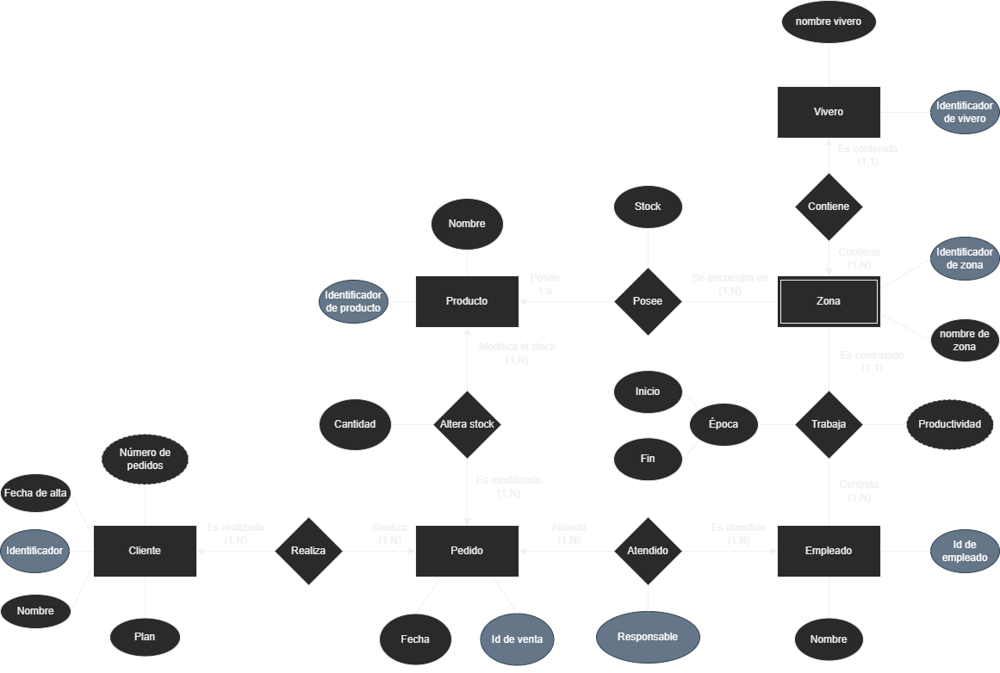
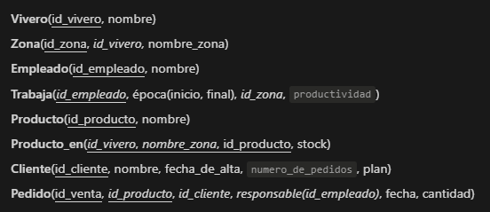
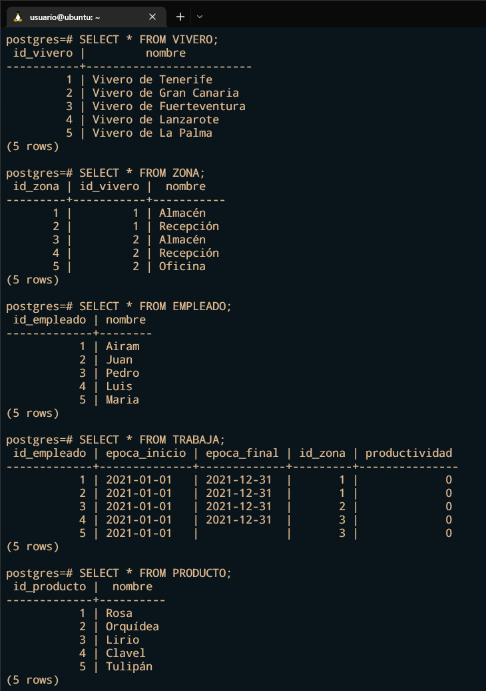
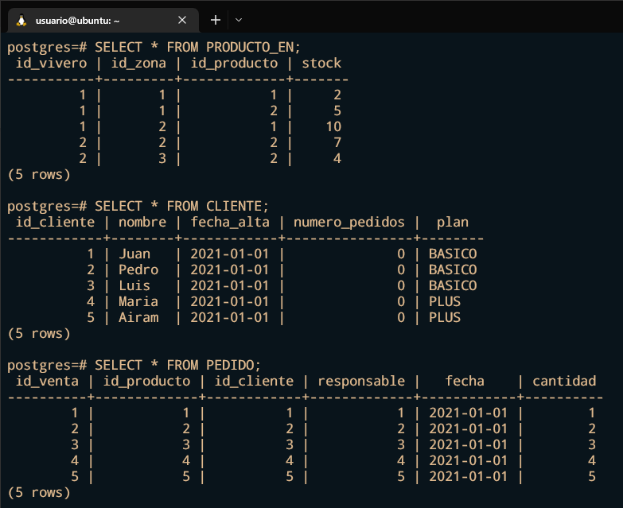

# Práctica 4: Modelo relacional (Viveros)

## Autor

Airam Rafael Luque León (alu0101335148@ull.edu.es)

## 1. Modelo entidad-relación



## 2. Uso del script

```bash
$ sudo su postgres
$ psql 
$ \i script.sql
```

## 2. Modelo relacional



## 3. Salida del script




